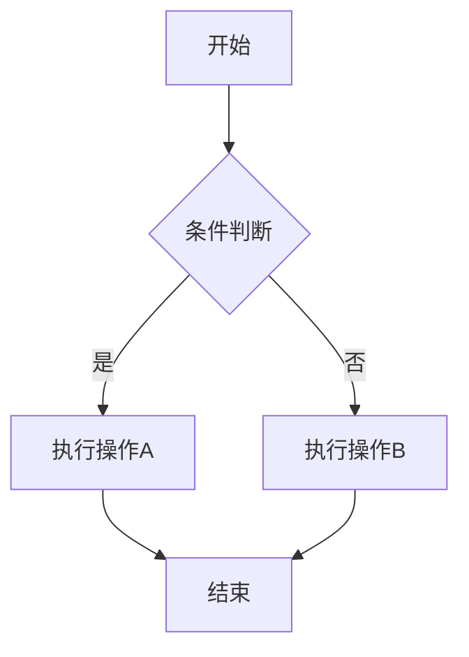
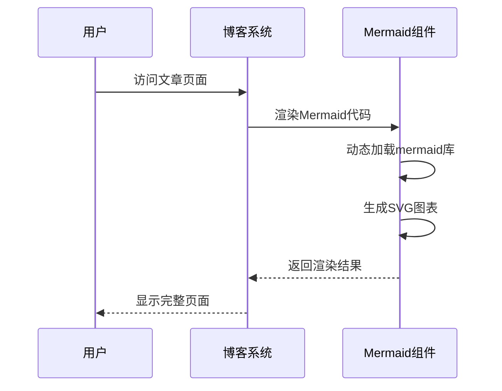
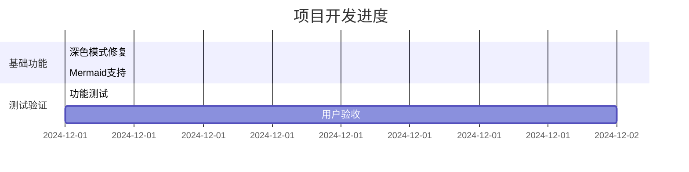

# 功能测试验证

## 深色模式测试

### ✅ 已修复的深色模式问题

1. **首页卡片组件**
   - PostCard背景色：`bg-white dark:bg-gray-800`
   - 文字颜色：`text-gray-800 dark:text-gray-200`
   - 元数据颜色：`text-gray-500 dark:text-gray-400`

2. **文章详情页**
   - 主容器：`bg-white dark:bg-gray-800`
   - 标题：`text-gray-900 dark:text-gray-100`
   - 分割线：`border-gray-200 dark:border-gray-700`
   - 段落文字：`text-gray-900 dark:text-gray-100`
   - 链接：`text-blue-600 dark:text-blue-400`

3. **侧边栏组件**
   - 背景：`bg-white dark:bg-gray-800`
   - 标题：`text-gray-900 dark:text-gray-100`
   - 链接：`text-gray-600 dark:text-gray-300`

4. **布局组件**
   - 头部：`bg-white dark:bg-gray-800`
   - 底部：`bg-gray-50 dark:bg-gray-800`
   - 导航链接：支持深色模式

## Mermaid图表测试

### ✅ 已实现的Mermaid功能

1. **MermaidBlock组件**
   - 动态导入mermaid库
   - 图表渲染功能
   - 错误处理机制
   - 代码显示/隐藏切换
   - 复制代码功能

2. **集成到Markdown渲染**
   - 检测`language-mermaid`代码块
   - 自动渲染为图表
   - 深色模式适配

### 测试用例

#### 流程图

#### 时序图

#### 甘特图

## 验证清单

### 深色模式验证
- [ ] 切换到深色模式
- [ ] 检查首页卡片样式
- [ ] 检查文章详情页样式
- [ ] 检查侧边栏样式
- [ ] 检查导航和底部样式
- [ ] 验证表格、引用等元素

### Mermaid图表验证
- [ ] 访问包含Mermaid代码的文章
- [ ] 验证图表正确渲染
- [ ] 测试代码显示/隐藏功能
- [ ] 测试代码复制功能
- [ ] 验证错误处理机制
- [ ] 检查深色模式下的图表显示

### 响应式验证
- [ ] 移动端深色模式
- [ ] 移动端Mermaid图表
- [ ] 平板设备适配
- [ ] 桌面端完整功能

---

**测试完成时间**: 2024年12月
**修复状态**: ✅ 完成 