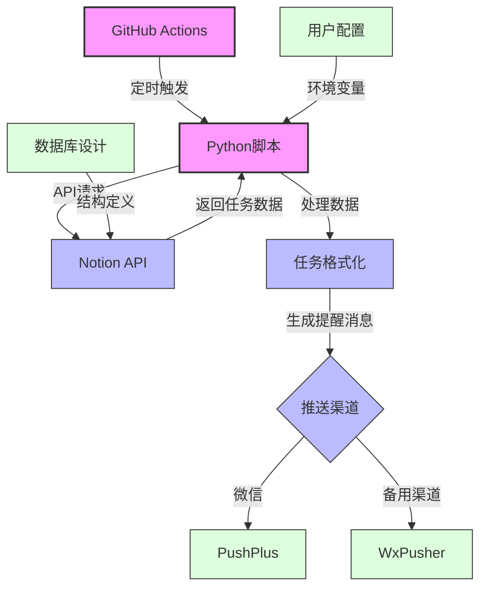
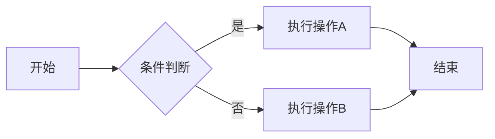
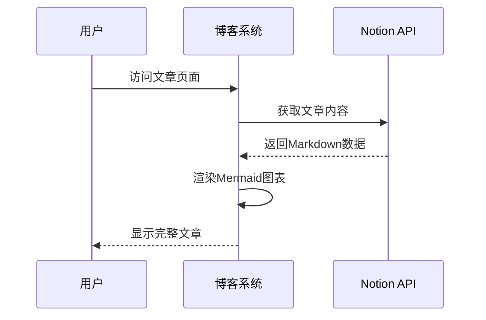
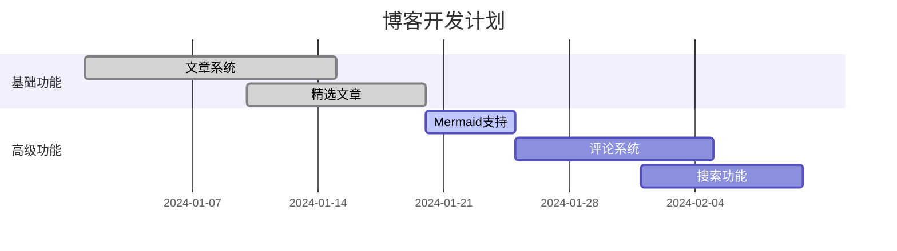

# Mermaid图表渲染测试

## 用户提供的示例图表

## 功能特点

✅ **图表渲染模式**（默认）：直接显示可视化图表  
✅ **双模式切换**：可切换查看"代码+图表"模式  
✅ **代码复制功能**：一键复制Mermaid源代码  
✅ **错误处理**：渲染失败时显示友好提示  
✅ **响应式设计**：适配移动端设备  

## 更多示例

### 流程图

### 时序图

### 甘特图

现在这些图表都会以可视化形式展示，不再是纯文本代码！ 