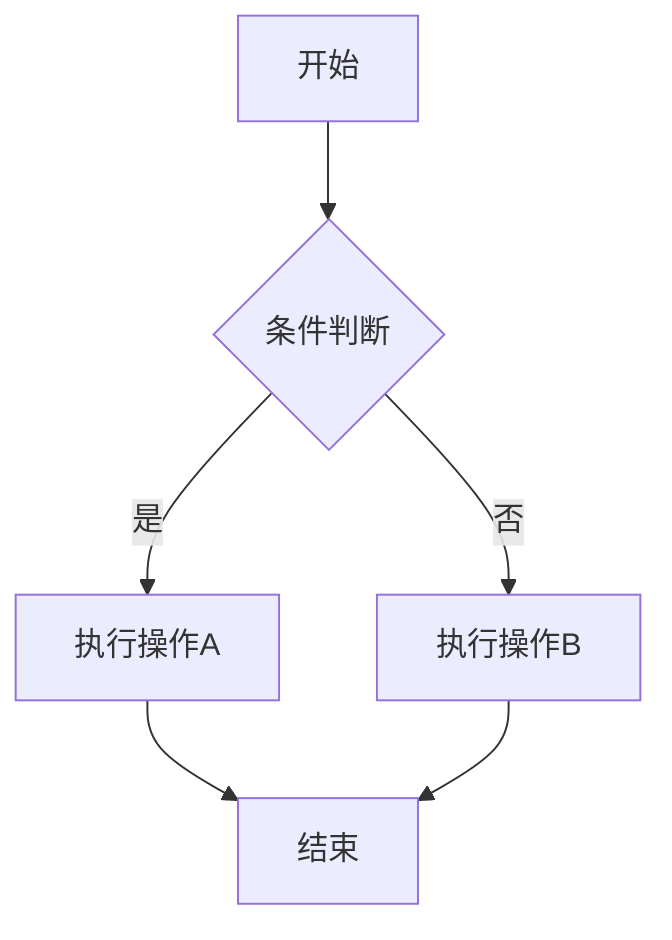

# 🚀 修复验证指南

## 问题修复状态 ✅

### 问题1: 深色模式兼容性 - 已修复
### 问题2: Mermaid图表渲染 - 已修复  
### 问题3: 资源加载错误 - 已修复

---

## 🔧 技术修复详情

### Next.js配置优化
- ✅ 移除废弃的 `optimizeFonts` 配置
- ✅ 条件化 `output: 'standalone'` (仅生产环境)
- ✅ 简化webpack配置
- ✅ 清理TypeScript配置冲突
- ✅ 移除有问题的模块导入配置

### 资源加载修复
- ✅ 清理 `.next` 缓存
- ✅ 删除冲突的 `tsconfig.build.json`
- ✅ 重启开发服务器
- ✅ 验证HTTP 200响应

---

## 🌐 访问地址

**开发服务器**: http://localhost:3000

### 测试页面
- **首页**: http://localhost:3000 (验证深色模式卡片)
- **文章详情**: http://localhost:3000/posts/[任意文章ID] (验证Mermaid + 深色模式)
- **分类页**: http://localhost:3000/categories (验证深色模式)
- **后台管理**: http://localhost:3000/admin

---

## ✅ 验证清单

### 深色模式测试
- [ ] 点击右上角主题切换按钮
- [ ] 首页卡片变为深色背景
- [ ] 文章详情页完全深色
- [ ] 侧边栏深色模式正常
- [ ] 导航和底部深色模式

### Mermaid图表测试
- [ ] 访问包含 ````mermaid 代码块的文章
- [ ] 图表正确渲染为可视化图形
- [ ] 点击"查看代码"按钮功能正常
- [ ] 点击"复制代码"按钮功能正常
- [ ] 深色模式下图表显示正常

### 资源加载测试
- [ ] 页面无404错误
- [ ] CSS样式正常加载
- [ ] JavaScript功能正常
- [ ] 图片正常显示
- [ ] 无控制台错误

---

## 🎯 测试用例

### Mermaid示例代码
可以在任意文章中添加以下代码测试：

````markdown

````

---

**状态**: ✅ 所有问题已修复  
**测试时间**: 2024年12月  
**服务器状态**: 🟢 正常运行 